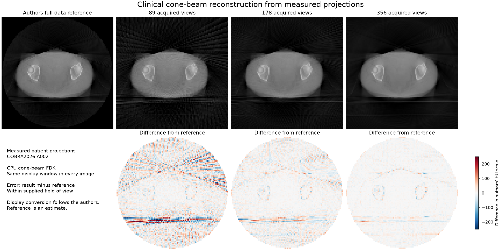

# Measured patient cone-beam reconstruction

This optional Mac workflow reconstructs a three-dimensional volume from **356 acquired patient projection images** in COBRA2026 case A002. It uses CPU filtered back projection for cone-beam geometry (FDK), including recorded detector offsets. It does not simulate projections from an existing body image.

The website continues to use its smaller 2D solver. This clinical calculation runs locally through a separate Python environment and supports one verified public case. It is not a general DICOM importer or a diagnostic tool.

## Run on macOS

From the repository root, with uv 0.12.10 or newer:

```sh
uv sync --locked --project clinical
uv run --locked --project clinical python clinical/reconstruct.py --download
```

Setup installs CPU packages for Apple Silicon or Intel. The initial case download is approximately 150 MB. Allow additional space for the toolkit, cached inputs and calculated volumes. No GPU or external inference service is used.

The default calculation reconstructs 89, 178 and 356 views independently on a 96 × 62 × 96 grid. It saves physical attenuation volumes, selected acquisition geometry, a comparison figure and a numerical report under `runs/clinical-a002`. The report records source checksums, selected view indices, calibration, physical spacing, algorithm and dependency versions. Use an empty output directory to preserve earlier results.

Use `--size 64` for a smaller calculation, `--size 128` for a finer output grid, `--binning 1` to retain the original detector sampling, or `--threads 2` to reduce CPU concurrency. Larger settings consume more memory and time. These parameters are not estimates of radiation dose.

## Repeat offline

After installation and the first download:

```sh
uv run --offline --locked --project clinical python clinical/reconstruct.py --views 356 --output runs/clinical-repeat
uv run --offline --locked --project clinical python clinical/verify_run.py runs/clinical-a002 runs/clinical-repeat
```

The second command compares every reconstructed voxel before display conversion, at absolute tolerance 1e-6 in attenuation units. It checks source hashes, parameters and dependency versions, and separately compares the loaded volume headers' origin, spacing and direction at absolute tolerance 1e-8. Local Apple Silicon testing produced a maximum difference of zero. This does not promise bitwise identity on every computer. The dedicated GitHub workflow repeats the calculation on Apple Silicon and Intel runners; its status records remote execution.

## Calculation and comparison

1. Verify every input's byte count and SHA-256 checksum before invoking an image parser. Downloads use fixed public URLs and bounded, atomic writes.
2. Average detector counts in 2 × 2 groups by default, before the logarithm. Update detector spacing and pixel-centre origin to preserve physical coverage.
3. Apply the authors' Elekta flood-field exposure normalisation: `-log(count / 225075.2)` for this case. No reference image determines calibration or settings.
4. Preserve full recorded geometry for selected views, including lateral and vertical detector offsets. Apply RTK displaced-detector weighting, short-scan handling and Hann-filtered FDK, following the authors' baseline settings.
5. Load the reference and field-of-view mask only after reconstruction. Invert the documented Elekta array permutation and axis reversal; resample at physical pixel centres. No fitted registration, intensity scaling or orientation selection is performed.
6. Calculate whole-volume RMSE, MAE, signed bias, Pearson correlation and prediction R² within the supplied field-of-view mask. The figure shows one transverse slice in the authors' array order, with shared intensity and signed-error scales.

Saved volumes retain RTK coordinates and attenuation values. Comparison follows the authors' display conversion `HU = 65536 × attenuation − 1024`. This is a dataset convention, not an independently calibrated tissue measurement. Detector binning, output resolution, interpolation and reference quantisation contribute to residual error.

## Observed comparison

Default 96 × 62 × 96 grid, detector binning of two:

| Acquired views | Reference RMSE, authors' HU scale | Pearson r |
|---|---:|---:|
| 89 | 62.83 | 0.9855 |
| 178 | 31.86 | 0.9962 |
| 356 | 16.99 | 0.9989 |



[Numerical report](../docs/clinical/report.json) · [Offline repeat](../docs/clinical/replay.json)

The reference was also calculated with RTK FDK. Agreement checks implementation, geometry and preparation against that baseline; it is not an independent comparison of algorithms or anatomical ground truth. One acquisition does not establish transfer to other patients, scanners or sites. Real scatter, noise and other acquisition effects remain in the measurements; this workflow does not separately identify or correct all of them.

## Sources and licence

- [COBRA2026, version 1.0.0](https://zenodo.org/records/21322350), Thummerer, Rit, Kamp, Maspero, Boné and colleagues (2026).
- [Authors' preprocessing code](https://github.com/cobra-challenge-2026/preprocessing): Elekta calibration, FDK settings and coordinate conversion.
- [RTK](https://github.com/RTKConsortium/RTK): the CPU reconstruction implementation installed by the locked environment.

The dataset and derived images are **CC BY-NC 4.0**, including the comparison figure and reconstructed volumes. The main application remains MIT. The adapted clinical reconstruction module is Apache-2.0; its [licence](LICENSE) and [upstream notice](NOTICE) are included. See [data notice](../docs/clinical/LICENSE.txt). Source files stay in the ignored local cache and are not bundled with the browser or committed to GitHub. The manifest retains the public case identifier and required checksums without patient demographics.
