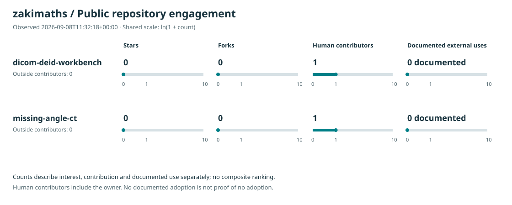

# Repository engagement and documented adoption

This report tracks public, directly owned, non-fork repositories belonging to `zakimaths`. Private repositories are excluded. Counts are observations at the date shown, not live values or a forecast.



[Raw observations and API sources](snapshot.json) · [Reviewed adoption evidence](adoption.json) · [Collection and chart script](../../scripts/github_engagement.py)

## What the four measures mean

| Measure | Definition | Interpretation |
|---|---|---|
| Stars | GitHub's `stargazers_count` | Interest or bookmarking; not proof of use |
| Forks | GitHub's `forks_count` | Copies of a repository; not necessarily maintained or used |
| Human contributors | Distinct `User` logins from all pages of GitHub's contributors endpoint | Includes the owner, excludes bot accounts and unlinked anonymous authors; outside contributors are also shown separately |
| Documented external uses | Distinct independent projects with reviewed public evidence, per repository | A documented lower bound; zero entries does not establish zero actual use |

GitHub's contributor statistics can lag behind recent commits. Missing contributor data is shown as unavailable, never converted to zero. Contributors can overlap between repositories, so summing rows does not measure unique people across the account.

Each plotted value is **ln(1 + count)**. Adding one lets zero remain visible; the log transformation compresses large differences. Raw counts appear above the chart and as tick labels. Every panel shares the same scale within a snapshot. The scale adapts to the largest observation, so compare raw counts or transformed values when comparing snapshots. There is no weighted composite score: stars, collaboration and confirmed use measure different things.

## Refresh or reproduce

From the repository root, with Python 3.12 and an authenticated [GitHub CLI](https://cli.github.com/):

```sh
python3 scripts/github_engagement.py
```

This makes read-only requests to GitHub, paginates the repository and contributor lists, and writes the snapshot and SVG. It does not change repository settings or collect demo traffic. Review and commit the output when a new observation is useful; Git history retains previous snapshots. The report is not scheduled and is not part of application startup, the demo builder or the reconstruction worker.

To reproduce the chart exactly from the saved observations without a network request:

```sh
python3 scripts/github_engagement.py --offline
```

## Evidence of adoption

The [usage form](https://github.com/zakimaths/missing-angle-ct/issues/new?template=usage.yml) accepts public reports of independent use. A maintainer must check the linked evidence before adding an entry. A submitted issue does not automatically increase the count.

Each ledger entry requires `repository`, a stable `project_key`, `independent_owner`, `evidence_url`, `description` and `reviewed_on` (ISO date). Use one project key across multiple reports about the same use. Evidence might be a public course exercise, a downstream integration, a paper using the software or an independent reproduction. Self-owned examples, fork creation alone, mentions and generated traffic do not establish external adoption. Retain attribution, avoid publishing private information, and remove entries whose evidence no longer supports the claim.

## Work that can improve genuine use

1. Make the first experiment easy to complete: a direct demo, a specific comparison and an export that another person can reproduce.
2. Reduce contribution friction: concrete starting points, accurate setup instructions, structured reports and clear acceptance checks.
3. Publish evidence with results: share measured outcomes, source attribution and limitations. Link readers to the experiment and repository.
4. Learn from independent users: prioritise repeatable problems, review outside contributions and document their impact.

The first two are supported by the current README and contribution forms. Sharing and outside adoption remain human activities; no growth is claimed merely because the documentation or chart changed.

GitHub describes stars as a measure of interest and distinguishes them from watchers in its [starring API documentation](https://docs.github.com/en/rest/activity/starring). Its [repository guidance](https://docs.github.com/en/repositories/creating-and-managing-repositories/best-practices-for-repositories) explains the role of project documentation and contribution guidelines. The adoption definition above is this report's explicit convention, not a GitHub-provided adoption score.
